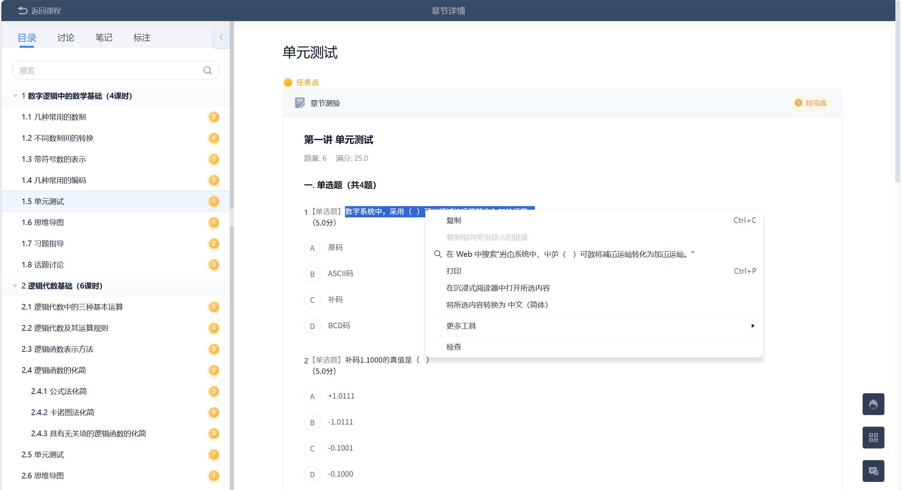
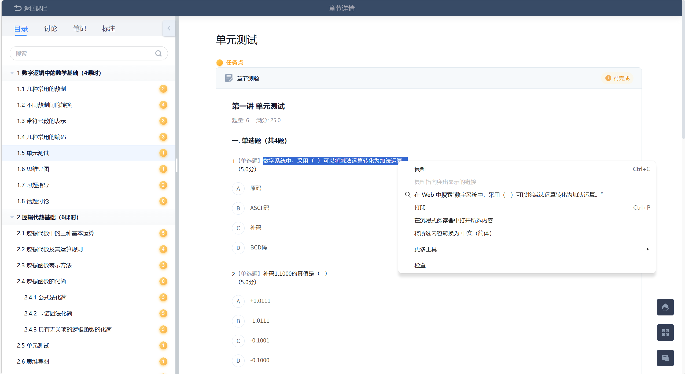

# GlyphCopy

[简体中文](README.md)

Decode Chaoxing/Learning Pass test-chapter font obfuscation so copied text is
the original readable content instead of garbled characters.

| Before | After |
| --- | --- |
|  |  |

GlyphCopy is a local Chrome/Edge MV3 extension for inspecting and replacing
Chaoxing (`chaoxing.com`) text that is hidden behind custom font glyph
obfuscation. It is built for pages that look readable on screen but copy as
garbled or obfuscated characters. The current project also includes small Python
tools for extracting sample fonts from HAR captures and rebuilding the bundled
glyph fingerprint dictionary.

Chinese install guide: [docs/INSTALL.zh-CN.md](docs/INSTALL.zh-CN.md)

## What It Does

- Scans Chaoxing pages for suspicious `@font-face` rules, especially
  `font-cxsecret` and embedded data URI fonts.
- Parses the suspicious font `cmap` table and records the observed codepoints
  used by text nodes on the page.
- Recursively inspects accessible same-origin documents and iframes.
- Renders observed glyphs to a 28x28 fingerprint and ranks them against the
  bundled common Chinese glyph dictionary.
- Rechecks top matches with canvas bitmap/projection scoring.
- Stores recognition results in `chrome.storage.local` under
  `glyphcopy:mapping:<fontHash>`.
- Lets manual corrections override automatic mappings.
- Applies mappings back to page text nodes rendered with the matching
  suspicious font, and can restore the original text during the current page
  session.
- Supports a domain-wide Chaoxing auto-apply switch with low-frequency polling,
  mutation-triggered retry, and popup diagnostics.
- Imports and exports mapping-cache JSON so confirmed mappings can be reused.

## Project Layout

```text
extension/
  manifest.json                         Chrome MV3 extension manifest
  content/content.js                    page scan, recognition, replacement, auto apply
  popup/                                popup UI
  data/glyph-fingerprints-noto-sans-sc.json
                                        bundled glyph fingerprint dictionary
tools/
  analyze_cxsecret_har.py               extract cxsecret font and decoded samples from HAR
  build_glyph_fingerprint_dict.py       rebuild bundled fingerprint dictionary
docs/
  bugfix-plan.md                        historical repair plan and validation checklist
artifacts/                              local generated analysis outputs, gitignored
output/                                 local browser profiles/runtime copies, gitignored
```

## Install The Extension Locally

1. Open `chrome://extensions` or `edge://extensions`.
2. Enable developer mode.
3. Load the unpacked extension from the repository's `extension/` folder:

   ```text
   extension/
   ```

4. Open a Chaoxing page and click the GlyphCopy toolbar icon.

The extension is intentionally limited to `*://*.chaoxing.com/*` by
`extension/manifest.json`.

## Popup Workflow

1. Scan the current page to detect suspicious fonts and text nodes.
2. Run recognition to build or refresh the mapping cache for observed glyphs.
3. Review low-confidence rows in the recognition panel.
4. Enter manual corrections where needed and save them.
5. Apply replacement to the page.
6. Restore the original text if the current page session needs to be rolled
   back.

The auto-apply toggle is off by default. When enabled, GlyphCopy stores one
Chaoxing-domain setting and later page loads will scan, recognize missing
glyphs, and apply mappings automatically. Pages without suspicious fonts are
scanned and left unchanged.

## Mapping Cache

Recognition cache keys use this shape:

```text
glyphcopy:mapping:<fontHash>
```

Cached entries keep automatic mappings and `manualMapping`. Page replacement
uses manual corrections first and falls back to automatic mappings. Live popup
recognition can include glyph previews for inspection, but persistent/exported
cache data strips preview data URLs to keep storage small.

## Python Tools

Install tool dependencies in your preferred Python environment:

```powershell
python -m pip install beautifulsoup4 fonttools pillow
```

Extract a Chaoxing sample font and decoded blocks from a local HAR capture:

```powershell
python .\tools\analyze_cxsecret_har.py .\mooc1.chaoxing.com1.har
```

Rebuild the bundled fingerprint dictionary:

```powershell
python .\tools\build_glyph_fingerprint_dict.py
```

If the default Chinese font discovery does not find a suitable font, pass one
explicitly:

```powershell
python .\tools\build_glyph_fingerprint_dict.py --font <path-to-chinese-font>
```

HAR files, generated artifacts, and browser profiles can contain cookies,
course data, or other local state. They are ignored by git through
`.gitignore`.

## Validation

Useful static checks after changing the tracked code:

```powershell
git diff --check
python -m py_compile .\tools\analyze_cxsecret_har.py .\tools\build_glyph_fingerprint_dict.py
```

Useful local smoke checks when sample HAR files are available:

```powershell
python .\tools\analyze_cxsecret_har.py .\mooc1.chaoxing.com1.har
python .\tools\build_glyph_fingerprint_dict.py
```

After extension code changes, reload the unpacked extension and verify scan,
recognize, apply, restore, manual correction, import/export, and auto apply on a
real Chaoxing page.

## Current Limits

- The extension only declares Chaoxing host permissions.
- Cross-origin frames cannot be read directly by the top page script. Matching
  Chaoxing frames can receive their own content script, while the top frame
  remains the main popup/auto-apply coordinator.
- Recognition quality depends on the bundled candidate dictionary and the local
  font used to build `glyph-fingerprints-noto-sans-sc.json`.
- Low-confidence matches are highlighted in the popup inspection panel only;
  page content is not visually marked.
